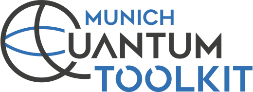
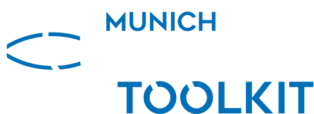

```{only} html
<div style="margin-top: 0.5em">
<div class="only-light" align="center">
  
</div>
<div class="only-dark" align="center">
  
</div>
</div>
```

# The MQT Handbook

```{raw} latex
\begin{abstract}
```

Quantum computers are becoming a reality and numerous quantum computing applications with a near-term perspective (e.g., for finance, chemistry, machine learning, and optimization) and with a long-term perspective (e.g., for cryptography or unstructured search) are currently being investigated.
However, designing and realizing potential applications for these devices in a scalable fashion requires automated, efficient, and user-friendly software tools that cater to the needs of end users, engineers, and physicists at every level of the entire quantum software stack.
Many of the problems to be tackled in that regard are similar to design problems from the classical realm for which sophisticated design automation tools have been developed in the previous decades.

The _[Munich Quantum Toolkit (MQT)](https://mqt.readthedocs.io)_ is a collection of software tools for quantum computing that explicitly utilizes this design automation expertise.
Our overarching objective is to provide solutions for design tasks across the entire quantum software stack.
This entails high-level support for end users in realizing their _applications_, efficient methods for the _classical simulation_, _compilation_, and _verification_ of quantum circuits, tools for _quantum error correction_, support for _physical design_, and more.
These methods are supported by corresponding _data structures_ (such as decision diagrams or the ZX-calculus) and _core methods_ (such as SAT encodings/solvers).
All of the developed tools are available as open-source implementations and are hosted on [github.com/munich-quantum-toolkit](https://github.com/munich-quantum-toolkit).

````{only} latex
```{note}
A live version of this document is available at [mqt.readthedocs.io](https://mqt.readthedocs.io).
```
````

```{raw} latex
\end{abstract}

\sphinxtableofcontents
```

```{only} html
For a comprehensive visual depiction of the MQT tools, we invite you to download our <a href="_static/flyers/mqt_flyer.pdf" title="Link to MQT flyer">MQT Flyer</a>.

<div style="float: right; margin-top:0em; margin-bottom:3em;">
    <a href="_static/flyers/mqt_flyer.pdf" title="Link to MQT flyer">
        <figure style="display: inline-block;">
            
            <figcaption style="text-align: center;">MQT Overview Flyer</figcaption>
        </figure>
    </a>
</div>
```

```{toctree}
:caption: The MQT Handbook

handbook/01_intro
handbook/02_simulation
handbook/03_compilation
handbook/04_verification
handbook/05_benchmarking
handbook/06_implementations
handbook/07_conclusions
handbook/references
```

````{only} html
## Contributors and Supporters

The _[Munich Quantum Toolkit (MQT)](https://mqt.readthedocs.io)_ is developed by the [Chair for Design Automation](https://www.cda.cit.tum.de/) at the [Technical University of Munich](https://www.tum.de/)
and supported by the [Munich Quantum Software Company (MQSC)](https://munichquantum.software).
Among others, it is part of the [Munich Quantum Software Stack (MQSS)](https://www.munich-quantum-valley.de/research/research-areas/mqss) ecosystem,
which is being developed as part of the [Munich Quantum Valley (MQV)](https://www.munich-quantum-valley.de) initiative.

<div style="margin-top: 0.5em">
<div class="only-light" align="center">
  
</div>
<div class="only-dark" align="center">
  
</div>
</div>

## Cite This

If you want to cite the Munich Quantum Toolkit, please use the following BibTeX entry:

```bibtex
@inproceedings{mqt,
    title = {The {{MQT}} Handbook: {{A}} Summary of Design Automation Tools and Software for Quantum Computing},
    shorttitle = {{The MQT Handbook}},
    booktitle = {IEEE International Conference on Quantum Software (QSW)},
    author = {Wille, Robert and Berent, Lucas and Forster, Tobias and Kunasaikaran, Jagatheesan and Mato, Kevin and Peham, Tom and Quetschlich, Nils and Rovara, Damian and Sander, Aaron and Schmid, Ludwig and Schoenberger, Daniel and Stade, Yannick and Burgholzer, Lukas},
    date = {2024},
    doi = {10.1109/QSW62656.2024.00013},
    eprint  = {2405.17543},
    eprinttype = {arxiv},
    addendum = {A live version of this document is available at \url{https://mqt.readthedocs.io}},
}
```
````

````{only} html
```{toctree}
:hidden:
:caption: Tool Overview and Statistics

overview
stats
```
````

```{toctree}
:hidden:
:caption: Tool Documentation

MQT Core <https://mqt.readthedocs.io/projects/core/en/latest>
MQT DDSIM <https://mqt.readthedocs.io/projects/ddsim/en/latest>
MQT QMAP <https://mqt.readthedocs.io/projects/qmap/en/latest>
MQT QCEC <https://mqt.readthedocs.io/projects/qcec/en/latest>
MQT QECC <https://mqt.readthedocs.io/projects/qecc/en/latest>
MQT Bench <https://mqt.readthedocs.io/projects/bench/en/latest>
MQT Predictor <https://mqt.readthedocs.io/projects/predictor/en/latest>
MQT Qudits <https://mqt.readthedocs.io/projects/qudits/en/latest>
MQT QUBOMaker <https://mqt.readthedocs.io/projects/qubomaker/en/latest>
MQT SyReC <https://mqt.readthedocs.io/projects/syrec/en/latest>
MQT QAO <https://mqt.readthedocs.io/projects/qao/en/latest>
MQT YAQS <https://mqt.readthedocs.io/projects/yaqs/en/latest>
MQT Debugger <https://mqt.readthedocs.io/projects/debugger/en/latest>
```
